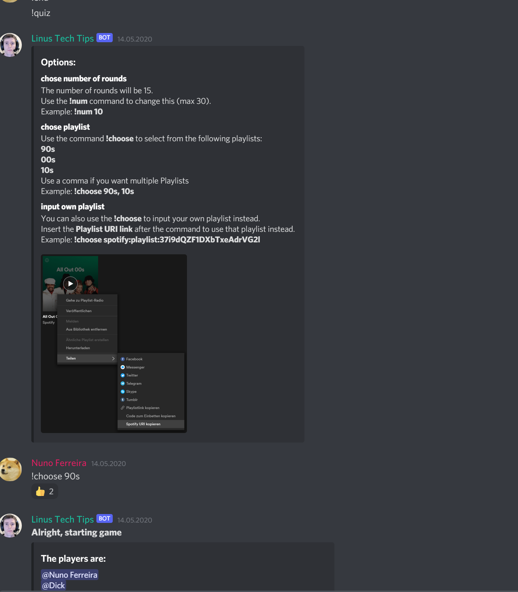
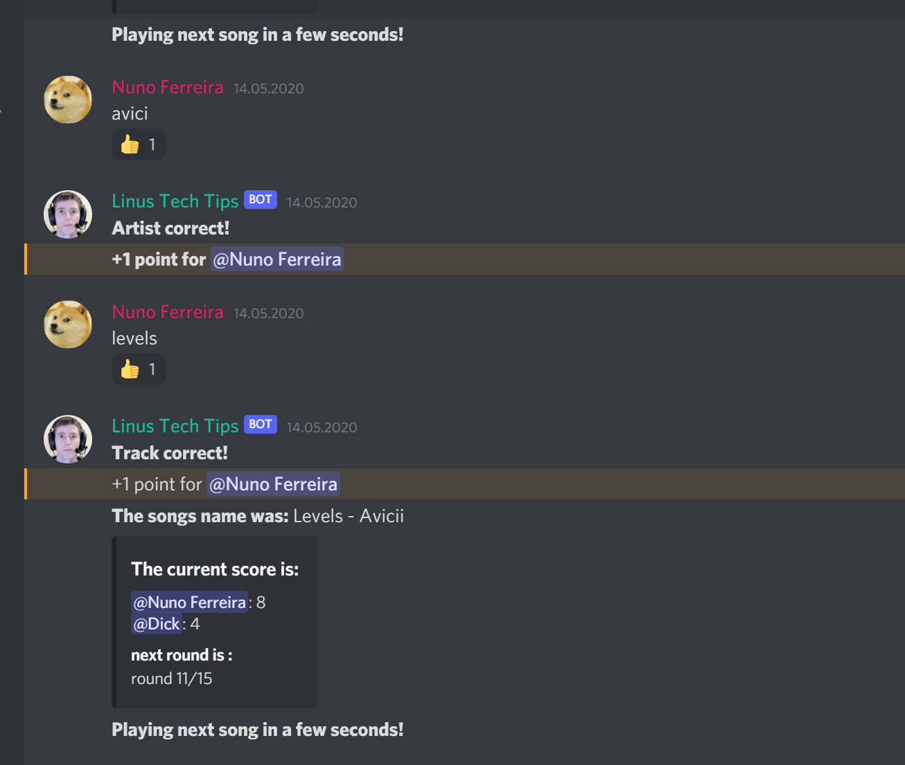
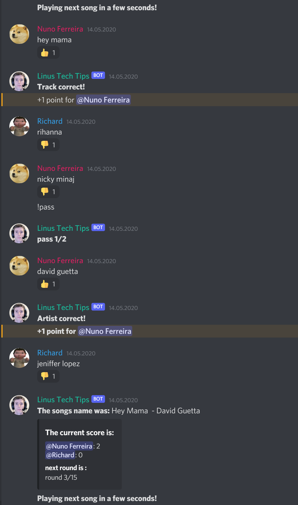

# Discord-Music-Quiz

## Discord Bot to play the Song Guessing Game

#### This Bot for the popular VoIP platform ***"discord"*** allows users to play the "Song Guessing Game". In which played songs need to be recognized by their name and artist.

#### This was my first bigger programming project back in early 2020, during the covid outbreak.

## Gameplay
The bot is called with the `!quiz` command, upon which he joins the callers voice-channel. The game all takes place
in the text-channel in which the command was called and the voice-channel for song input.

The bot starts by playing the first song, upon which all players currently present in the voice-channel can start typing in their
guesses for the current playing song. Each answer (song-name/artist) can only be given once, for which one point is rewarded.

After a few songs, the player with the most points wins.

## Setting up the Bot on your server
Guide coming soon. For now lookup the official Discord guide on how to setup a Bot and run this program locally.

## Screenshots
Game Start

Correct Answers

Multiplayer

